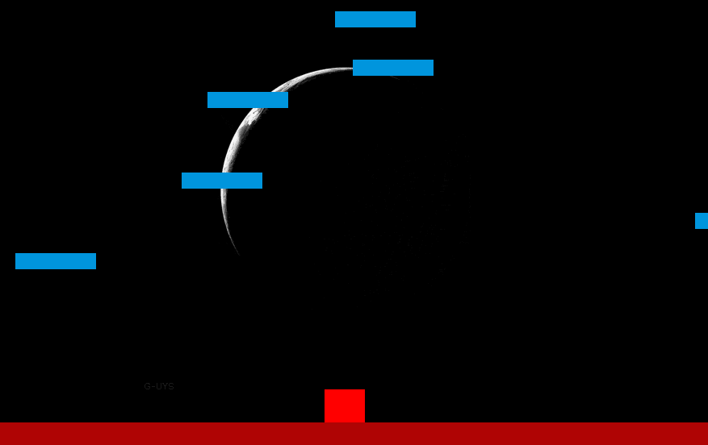
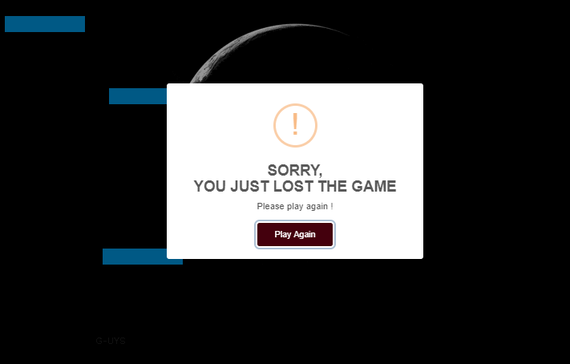
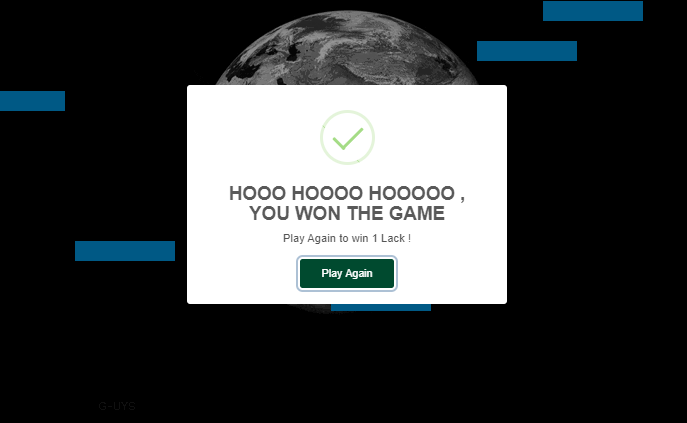

# COLLIDER GAME
  A Game developed using Canvas .

## Author: 
  #### <a href="https://github.com/guruk05">Guru Prasath</a>
  #### <a href="https://github.com/SudheerReddySingam">Sudheer Reddy</a>

## Developed Using:
 * #### <a href="https://html.com/">HTML</a>
 * #### <a href="https://getbootstrap.com/">BOOTSTRAP</a>
 * #### <a href="https://css-tricks.com/">CSS </a>
 * #### <a href="https://www.javascript.com/">JAVASCRIPT </a>

## Description:
  #### This is a single player game, which involves escaping from the obstacles and reaching the final top point.

## Design:
  
  
  
  
  
  
  
## Game Preview 
  

 
  
  
  
## Rules: 

  #### Player has to escape from the randomly moving obstacles without collision.
  
  
## Developed to Play !
  
  #### Play here: https://guruk05.github.io/Game/
             

